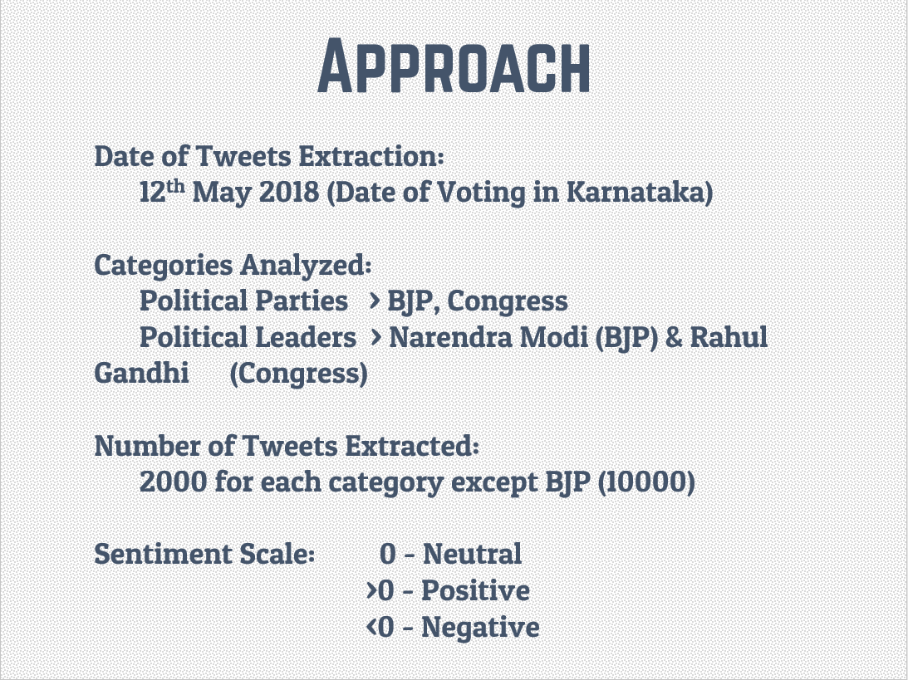
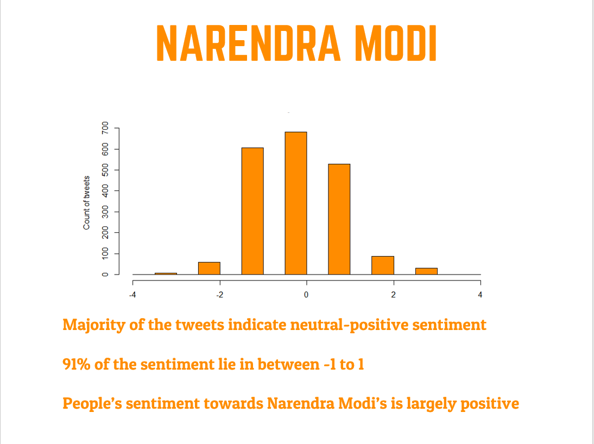
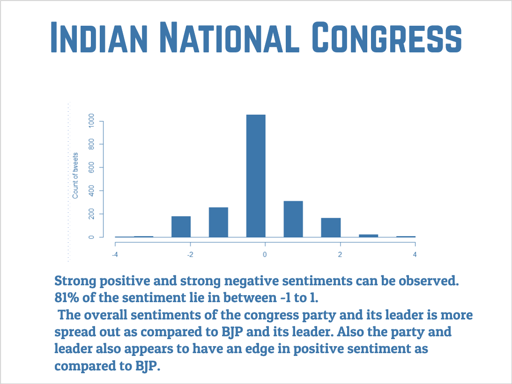

# Twitter-Sentiment-Analysis-using-R
> A detailed sentiment analysis of Karnataka State Elections 2018 in India and guage its impact on the final results. 
The entire summary of the project can be found in the [presentation](https://github.com/harshbg/Twitter-Sentiment-Analysis-using-R/blob/master/Sentiment%20Analysis%20of%20Karnatka%20State%20Elections%202018.pdf)

## Table of contents
* [General info](#general-info)
* [Screenshots](#screenshots)
* [Technologies and Tools](#technologies-and-tools)
* [Setup](#setup)
* [Process](#process)
* [Code Examples](#code-examples)
* [Features](#features)
* [Status](#status)
* [Inspiration](#inspiration)
* [Contact](#contact)

## General info

The purpose of the project is to understand how we can extract tweets from twitter and perform sentiment analysis on the same. 
I find Indian politics very facinating, and since the elections of one of the major state were coming up, I thought it would be interesting to understand how the sentiments are playing for the major parties and their leaders.

## Screenshots




## Technologies and Tools
* R - version 3.4
* Microsoft Excel

## Setup

The steps to extract tweets from twitter with specific filters can be found in [data extraction](https://github.com/harshbg/Twitter-Sentiment-Analysis-using-R/blob/master/Data%20Extraction). 
Two files of positive and negative words have been used to classify the sentiment of the tweets. The [code]() can be used to replicate the results. 

## Code Examples
Show examples of usage:

````
ktk <- searchTwitter('#karnatka', n=no.of.tweets, lang="en")
ktk2 <- searchTwitter('#karnatkaelections2018', n=no.of.tweets, lang="en")
ktk3 <- searchTwitter('#karnatkaelection', n=no.of.tweets, lang="en")
ktk4 <- searchTwitter('#battleforkarnatka', n=no.of.tweets, lang="en")
ktk5 <- searchTwitter('#karnatkakurukshetra', n=no.of.tweets, lang="en")
ktk6 <- searchTwitter('#KarnatkaAssembly', n=no.of.tweets, lang="en")
ktk7 <- searchTwitter('#karnatkavoting', n=no.of.tweets, lang="en")
ktk8 <- searchTwitter('#karnatkapolling', n=no.of.tweets, lang="en")
bjp <- searchTwitter('bjp', n=10000, lang="en")
congress <- searchTwitter('congress', n=2000, lang="en")
namo <- searchTwitter('narendra modi', n=2000, lang="en")
raga <- searchTwitter('rahul gandhi', n=2000, lang="en")
````

````
core.sentiment = function(sentences, pos.words, neg.words, .progress='none')
{
  require(plyr)
  require(stringr)
  
  # we got a vector of sentences. plyr will handle a list
  # or a vector as an "l" for us
  # we want a simple array ("a") of scores back, so we use 
  # "l" + "a" + "ply" = "laply":
  
  scores = laply(sentences, function(sentence, pos.words, neg.words) {
    
    # clean up sentences with R's regex-driven global substitute, gsub():
    sentence = gsub('[[:punct:]]', '', sentence)
    sentence = gsub('[[:cntrl:]]', '', sentence)
    sentence = gsub('\\d+', '', sentence)
    # and convert to lower case:
    sentence = tolower(sentence)
    
    # split into words. str_split is in the stringr package
    word.list = str_split(sentence, '\\s+')
    # sometimes a list() is one level of hierarchy too much
    words = unlist(word.list)
    
    # compare our words to the dictionaries of positive & negative terms
    pos.matches = match(words, pos.words)
    neg.matches = match(words, neg.words)
    
    # match() returns the position of the matched term or NA
    # we just want a TRUE/FALSE:
    pos.matches = !is.na(pos.matches)
    neg.matches = !is.na(neg.matches)
    
    # and conveniently enough, TRUE/FALSE will be treated as 1/0 by sum():
    score = sum(pos.matches) - sum(neg.matches)
    
    return(score)
  }, pos.words, neg.words, .progress=.progress )
  
  scores.df = data.frame(score=scores, text=sentences)
  return(scores.df)
}
````

````
##Narendra Modi
namog <- ldply(namo,function(t) t$toDataFrame() )
result1 <- score.sentiment(namog$text,pos.words,neg.words)
summary(result1$score)
hist(result1$score,col = 'dark orange', main = 'Sentiment Analysis for Narendra Modi ', ylab = 'Count of tweets')
count(result1$score)
library(xlsx)
write.xlsx(result1, "myResults.xlsx")

````

## Features
The sentiment analysis of the tweets was done succesfully. The sentiment however do not indicate much deviations towards any particular party or leader.

To-do list:
* Extract tweets for the entire week of election to guage a trend in the sentiments. 
* Expand the horizon of the tweets extracted by including more political parties, leaders, and more hashtgs. 

## Status
Project is: _finished_ however would like to implement in python using Natural Language Processing.  

## Inspiration
Indian news media is filled with upteen number of analysis and statistics during elections. I always fancied that and wanted to  try hands on with some of the analysis done behind the screen. 

## Contact
Created by me. Feel free to contact me! My other projects can be found [here](http://www.gupta-harsh.com/projects/).